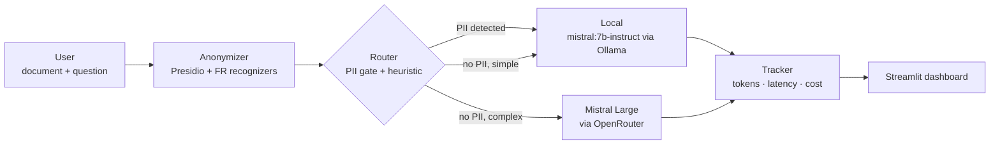

# pii-aware-llm-router

A document Q&A assistant that anonymizes personal data locally before anything leaves the machine, then routes each question to a local open-weight model or a frontier API model under an explicit, auditable sovereignty/cost rule — not a black-box classifier. Every call's tokens, latency and cost are logged, so the local-vs-API trade-off in [`docs/BUSINESS_CASE.md`](docs/BUSINESS_CASE.md) is a measured fact, not a slide.

Built as a deployment-strategy portfolio piece: the interesting part isn't the chat UI, it's the explainable routing rule and the measured numbers behind it.

## Flow



**The routing rule is deliberately simple and stated in plain English, not a trained classifier:** any document with detected PII is kept local, full stop — the sovereignty constraint overrides everything else. Only once that gate is clear does the router weigh document length, cross-document questions, and legal/technical keywords to decide between the free local model and the more capable API model. See `src/router.py` for the actual rule and `docs/BUSINESS_CASE.md` for how well that trade-off holds up against measured answer quality.

## Quickstart

### Docker (one command)

```bash
echo "OPENROUTER_API_KEY=sk-or-..." > .env
docker compose up
```

This starts Ollama, pulls `mistral:7b-instruct` on first run, and serves the Streamlit app at http://localhost:8501. The first `docker compose up` will take a while (model pull is ~4.4GB); subsequent runs are fast.

### Local dev (uv)

```bash
uv sync
ollama pull mistral:7b-instruct  # requires Ollama running locally
echo "OPENROUTER_API_KEY=sk-or-..." > .env

# CLI
set -a && source .env && set +a
PYTHONPATH=. uv run python src/cli.py path/to/document.txt "What is the penalty amount?"

# Streamlit app
uv run streamlit run src/app.py
```

`uv sync` and the Dockerfile install from the same `pyproject.toml`/`uv.lock` — including the pinned `fr_core_news_md` spaCy model — so the two install paths never drift.

## Project structure

```
├── src/
│   ├── anonymizer.py    # Presidio + custom FR recognizers (NIR, SIRET, salary)
│   ├── recognizers_fr.py
│   ├── router.py         # explicit, auditable local/api decision rule
│   ├── backends.py       # Ollama + OpenRouter HTTP calls
│   ├── tracker.py        # tokens/latency/cost logging + summary
│   ├── pipeline.py        # wires the above into one call
│   ├── cli.py             # one-shot CLI entry point
│   └── app.py              # Streamlit UI
├── eval/
│   ├── generate_gold_set.py  # synthetic FR PII gold set generator
│   ├── eval_anonymizer.py    # precision/recall/F1 per entity type
│   ├── questions.csv          # 18 questions over the real corpus, tagged by complexity
│   ├── run_questions.py       # runs questions.csv through both routes, logs everything
│   ├── blind_grade.py         # splits results into a route-blind grading sheet
│   └── merge_grades.py        # reattaches routes, summarizes quality by route
├── scripts/fetch_corpus.py    # downloads + checksum-verifies the real PDF corpus
├── data/
│   ├── synthetic/gold_set.jsonl    # PII gold set (committed — synthetic only)
│   ├── corpus_manifest.csv         # URLs + checksums of real public PDFs (not vendored)
│   └── corpus/                      # fetched by fetch_corpus.py, gitignored
└── docs/BUSINESS_CASE.md      # the measured trade-off, written last
```

## Measurement methodology

Two separate evaluations, because "cheap and local" and "correct" are different axes:

- **Anonymizer accuracy** (`eval/eval_anonymizer.py`): precision/recall/F1 per PII type against a synthetic gold set with ground truth planted at generation time, including deliberately hard cases (non-French-origin names, hyphenated/particle surnames, surnames that are also common nouns).
- **Router quality** (`eval/run_questions.py` + `eval/blind_grade.py`): 18 questions over 7 real public documents (CNIL and Conseil d'État sanction decisions, the Schrems II judgment in FR/EN, EDPB guidelines, a CAC 40 half-year report), each tagged with an a priori complexity label, run through **both** routes so cost/latency/quality are comparable question-for-question. Answers are graded blind to the route on a 1-3 scale — cost alone can't score a router, since "always local" trivially wins on cost.

Real public documents are never vendored — only `data/corpus_manifest.csv` (URLs + SHA-256 checksums) is committed; `scripts/fetch_corpus.py` re-downloads and verifies them. No real personal data is ever committed to this repository.

## Results

See [`docs/BUSINESS_CASE.md`](docs/BUSINESS_CASE.md) for the full write-up: anonymizer precision/recall per entity type, router decisions vs. measured answer quality, real measured cost/latency per route, and a cost sensitivity analysis.

## Limitations

- The anonymizer over-detects PERSON and LOCATION (high recall, lower precision) — see `docs/BUSINESS_CASE.md` §3 for the measured numbers. This is a deliberate safe-failure direction for a masking system, not an oversight.
- **The local route reliably fails, not degrades, on large documents.** On CPU-only hardware, `mistral:7b-instruct` at its real 32,768-token context window only completed 3 of 18 real-corpus questions within a 10-minute timeout — every document larger than ~50k characters timed out outright. See `docs/BUSINESS_CASE.md` §5 for what this means for the "local is free" framing, and why the router's PII-triggered sovereignty gate (which fires on 100% of these real documents) doesn't by itself make an all-local deployment viable without bigger hardware or a chunking strategy.
- This is a portfolio-scale proof of concept, not a production system: no auth, no persistence beyond flat CSV logs, no retry/backoff on API rate limits, small sample sizes throughout (see `docs/BUSINESS_CASE.md` §7).

## Status

Feature-complete as a proof of concept: anonymizer, router, both backends, tracker, Streamlit app, Docker install and the measured business case are all done and covered by real numbers, not estimates. Extending it further (chunking for long documents, a bigger/GPU-backed local model, a production-grade store instead of flat CSV logs) is out of scope for this portfolio piece — see the Limitations sections above and in `docs/BUSINESS_CASE.md` §7 for exactly where the line was drawn and why.

## License

[MIT](LICENSE)
