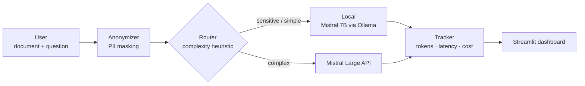

# pii-aware-llm-router

> **Status: work in progress.** 

## Flow

```mermaid
flowchart LR
    U[User<br/>document + question] --> A[Anonymizer<br/>PII masking]
    A --> R{Router<br/>complexity heuristic}
    R -->|sensitive / simple| L[Local<br/>Mistral 7B via Ollama]
    R -->|complex| M[Mistral Large API]
    L --> T[Tracker<br/>tokens · latency · cost]
    M --> T
    T --> S[Streamlit dashboard]
```
