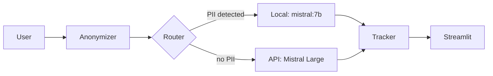

# pii-aware-llm-router

Document Q&A that anonymizes PII locally, then routes each question to a local model or a frontier API under an explicit, auditable sovereignty/cost rule — not a black-box classifier. Every call is logged, so the trade-off in [`docs/BUSINESS_CASE.md`](docs/BUSINESS_CASE.md) is measured, not estimated.



## Run it

```bash
echo "OPENROUTER_API_KEY=sk-or-..." > .env
docker compose up   # http://localhost:8501
```

Local dev: `uv sync && uv run streamlit run src/app.py`.

## Results

Measured anonymizer accuracy, router quality vs. cost, and a sensitivity analysis: [`docs/BUSINESS_CASE.md`](docs/BUSINESS_CASE.md). Headline: the sovereignty gate keeps everything local, but local fails outright (not degrades) past ~50k characters on CPU-only hardware — API is what's actually usable at real document sizes (§5).

Feature-complete portfolio POC · [MIT](LICENSE)
